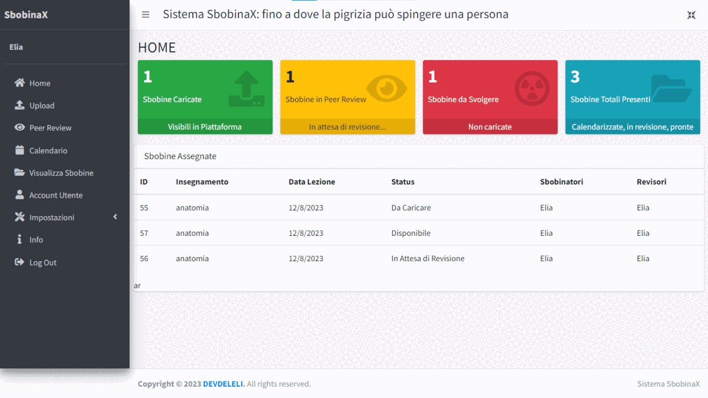

# PhpSbobinaX

ATTENZIONE! APPLICAZIONE NON ANCORA ADATTA AD UN UTILIZZO GENERALIZZATO PER MANCANZA DI UN SISTEMA DI SICUREZZA ADEGUATO!

## Indice
- [Introduzione](##Introduzione)
- [Installazione](#installazione)
- [Configurazione](#configurazione)
- [Utilizzo](#utilizzo)
- [Suggerimenti](#suggerimenti)
- [Licenza](#licenza)
- [Future Implementazioni](#future-implementazioni)
- [Changelog](#changelog)

## Introduzione
PhpSbobinaX è un gestionale per le sbobine universitarie semplice ma completo, in grado di
gestire le sbobine del semestre corrente, con la possibilità, al termine, di eseguirne
il download per lo storaggio o per la condivisione in altro ambiente (a causa dei limiti di spazio
dell'hosting, ho scelto di concentrarmi su un singolo semestre).

Il gestionale è stato sviluppato in PHP, con l'ausilio di Javascript e CSS, e utilizza un database
MySQL per la memorizzazione dei dati. Sfortunatamente, non è disponibile un installer, quindi
per l'installazione è necessario eseguire manualmente le operazioni descritte nella sezione apposita,
eventualmente aiutandosi con il file `install.sql` per la creazione del database.

Sono di seguito riportate alcune informazioni base. Per ulteriori informazioni, è possibile consultare
la documentazione presente nella cartella `Docs`, ove sono riportati i [manuali utente](Docs/Manuale.pdf) (unico per 
SuperUser ed utente normale) e di installazione, oltre ad una descrizione dei database ed il file `install.sql`.

## Installazione
Per installare il gestionale, è necessario eseguire le seguenti operazioni:
1. Creare un database MySQL, nominandolo "sbobinax" (in alternativa è necessario modificare il file `db_configurator.php`).
Qualora non fosse possibile creare un database, è possibile utilizzare un database già esistente, ma è necessario
modificare il file `db_configurator.php` inserendo i dati di accesso al database;
2. Selezionare "import" dalla barra superiore presente in phpMyAdmin (anche in un database già esistente);
3. Selezionare il file `install.sql` e confermare l'importazione;
4. Copiare i file del gestionale nella ROOT del sito web (o in alternativa nella cartella desiderata);
5. Modificare il file `db_configurator.php` inserendo i dati di accesso al database;
6. PER IL PRIMO ACCESSO, usare la seguente coppia di matricola e password: '123' e 'password', generare un nuovo
account utente con permessi di SuperUser e CANCELLARE l'account di default.

## Configurazione
A dire il vero, una volta installato il gestionale, non è necessario effettuare alcuna configurazione.
Tuttavia, prima di poter iniziare a caricare le sbobine, è necessario creare almeno un insegnamento,
programmare almeno una sbobina ed assegnare la stessa ad almeno uno sbobinatore e revisore (possono coincidere).
Tutte queste operazioni sono effettuabili solamente dal SuperUser. L'accesso tramite un account normale comporterà
la comparsa di un messaggio di errore.

### Creazione di un insegnamento
Per creare un insegnamento, è necessario selezionare la voce "Impostazioni", e successivamente "Inserisci Insegnamento".
Puoi visualizzare gli insegnamenti già presenti selezionando "Visualizza Insegnamenti".

### Programmazione ed assegnazione di una sbobina
Per programmare una sbobina, recarsi in "Impostazioni" e selezionare "Programma Sbobina". 
Da qui sarà anche possibile assegnare una sbobina ad uno sbobinatore o revisore.

### Creazione di un account utente
Per creare un account utente, recarsi su "Impostazioni", "Inserisci Sbobinatore". Per il primo accesso, la password 
corrisponde alla matricola. Fai particolare attenzione alla mail, in quanto, alla versione attuale, non è modificabile.

## Utilizzo
Per ogni informazione, si rimanda alla lettura dei manuali utente presenti nella cartella `Docs`. Sono inoltre presenti, al canale [YouTube](https://www.youtube.com/@devdeleli) , una serie di video che ne dimostrano il funzionamento.

## Suggerimenti
Per ogni suggerimento, segnalazione bug o richiesta di aiuto, è possibile riempire l'apposito form presente
su GitHub.

## Licenza
Il progetto è rilasciato sotto licenza MIT. Per ulteriori informazioni, si rimanda alla lettura del file `LICENSE`.

## Future Implementazioni

Di seguito inserisco le funzionalità che intendo implementare nelle successive versioni. È possibile proporre funzionalità compilando [questo link](https://www.devdeleli.github.io/request-informations) oppure tramite l'apposito form su GitHub. NON sono previsti rilasci fissi, l'applicazione verrà aggiornata "a tempo perso".

- Implementare una sicurezza maggiore
- Aggiungere un installer
- Aggiungere un updater
- Aggiungere la possibilità di auto prenotare le sbobine e le revisioni
- Aggiungere possibilità di auto cambiare il turno di sbobina (con meccanismo di protezione)
- Aggiungere possibilità di upload diretto su Google Drive o OneDrive 
- Add PWA
- Aggiungere motivo di rigetto sbobina
- Aggiungere notifica via web app e pwa

## Changelog

- PR 1.1.0 (12/08/2023)
  - Sistemata denominazione tabelle database
  - Aggiunta possibilità di definire numero dei malus
  - Aggiunto blocco automatico ed IRREVOCABILE dell'account al raggiungimento del numero di malus

- PR 1.0.0 (24/07/2023)
  - Prima versione stabile

